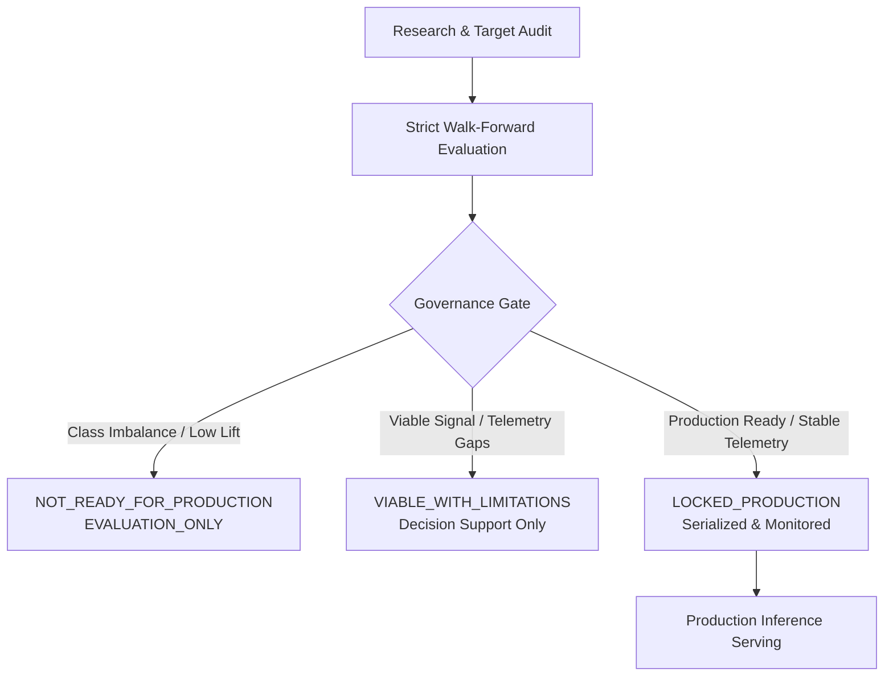

# IRIS ML Model Registry & Governance (v1.0.0)

This document provides the authoritative, frozen specification for the IRIS Machine Learning Model Registry and Governance layer implemented under PR-13.

---

## 1. Purpose

The IRIS Model Registry serves as the authoritative, deterministic, and auditable metadata and governance layer for all machine learning models in the repository. It consolidates scientific definitions, training metadata, validation methodologies, walk-forward performance metrics, calibration findings, operational threshold policies, explainability methods, evidence-based limitations, artifact hashes, and production availability into an immutable, programmatically verifiable contract.

---

## 2. Scope

The registry covers all three infrastructure project risk domains developed across PR-01 through PR-12:

1. **Schedule Extension Risk (3-Month Horizon)**: Operational production domain with regime-separated locked models.
2. **Cost Overrun Risk (3-Month Horizon)**: Research-governed domain classified as `NOT_READY_FOR_PRODUCTION`.
3. **Implementation Risk (3-Month Horizon)**: Physical progress stagnation domain classified as `VIABLE_WITH_LIMITATIONS`.

---

## 3. Non-Goals

To maintain strict auditability, stability, and governance boundaries, this layer explicitly enforces the following non-goals:

- **No Retraining**: Does not train or retrain any model at registry load or inference time.
- **No Model Mutation**: Does not modify model weights, serialized structures, or hyperparameters.
- **No Threshold Alteration**: Does not invent or shift operational decision thresholds.
- **No Recalibration**: Does not recalibrate or apply unverified probability adjustments.
- **No Silent Promotion**: Does not promote research models (`EVALUATION_ONLY`) to production availability.
- **No Dataset Mutation**: Does not alter canonical monthly or completed datasets.
- **No Fabricated Metrics**: Captures only empirically validated walk-forward metrics from PR-03 through PR-12.

---

## 4. Registry Architecture

The registry layer is structured as a decoupled, fail-closed metadata subsystem:

```
schemas/
└── ml_model_registry_v1.contract.json       # Frozen Draft 2020-12 JSON Schema

src/ml/
└── model_registry.py                        # Programmatic ModelRegistry class & CLI

artifacts/ml/model_registry_v1/
├── registry.json                            # Authoritative machine-readable registry
├── manifest.json                            # Cryptographic manifest & dependency catalog
└── verification_report.json                 # Deterministic verification output

docs/
└── ml_model_registry.md                     # Comprehensive governance documentation
```

---

## 5. Registry Schema

The schema contract (`schemas/ml_model_registry_v1.contract.json`) defines strict validation constraints:

- **Registry Version**: `1.0.0`
- **Registry ID**: `iris_ml_model_registry_v1`
- **Required Top-Level Keys**: `registry_version`, `registry_id`, `generation_policy`, `canonical_datasets`, `source_contracts`, `source_manifests`, `domains`.
- **Domain Records**: Defined under `#/$defs/DomainRecord`.
- **Model Records**: Defined under `#/$defs/ModelRecord`.
- **Enforced Enums**: Governance states, production availability states, candidate types, and regimes.

---

## 6. Domain Taxonomy

The repository taxonomy categorizes models across three primary risk domains:

| Domain Identifier | Canonical Target | Horizon | Governance Status | Production Availability | Operational Threshold |
| :--- | :--- | :---: | :--- | :--- | :---: |
| `schedule_3m` | `target_effective_schedule_ext_3m` | 3 Months | `LOCKED_PRODUCTION` | `AVAILABLE` | `0.50` |
| `cost_overrun` | `target_effective_cost_esc_3m` | 3 Months | `NOT_READY_FOR_PRODUCTION` | `NOT_AVAILABLE` | `None` |
| `implementation_risk` | `target_progress_stagnation_3m` | 3 Months | `VIABLE_WITH_LIMITATIONS` | `NOT_AVAILABLE` | `None` |

---

## 7. Schedule Model Registry Records

### Logical Hierarchy:
```
schedule_3m
├── legacy  -> CatBoostClassifier (catboost_full_v1__unweighted)
└── modern  -> LogisticRegression (logistic_static_only__unweighted)
```

### Legacy Model (`schedule_legacy_catboost`):
- **Model Family**: `CatBoostClassifier`
- **Regime**: `LEGACY` (Segments 1–3, pre-July 2025)
- **Features**: 36 features defined in `schemas/schedule_extension_3m_v1.contract.json`
- **Artifact**: `artifacts/ml/schedule_extension_3m/legacy_catboost/model.cbm`
- **SHA-256**: `59586004F5967602651156E0A26FE564015F240958F5416CBB565E4755C524EE`
- **Validation**: 12 strict walk-forward expanding window folds (2023-07 to 2025-03)
- **Key Metrics**: Average Precision: `0.4071`, ROC-AUC: `0.8064`, Brier Score: `0.0720`, Precision @ 0.50: `0.5426`, Recall @ 0.50: `0.2540`
- **Calibration**: Uncalibrated raw probabilities (Platt scaling evaluated in PR-05 but raw retained for lower Brier score)
- **Threshold**: Operational decision rule at `0.50`
- **Explainability**: TreeSHAP values in log-odds space

### Modern Model (`schedule_modern_logistic`):
- **Model Family**: `LogisticRegression`
- **Regime**: `MODERN` (Segment 4, July 2025 redesign onward)
- **Features**: 25 static/current features (longitudinal history reset after July 2025)
- **Artifact**: `artifacts/ml/schedule_extension_3m/modern_logistic/model.joblib`
- **SHA-256**: `679D9768869088BA8CEE297577B1935DCF903F00B38697BF9A3FFA2F7DEB5082`
- **Validation**: 5 strict walk-forward expanding window folds (2025-12 to 2026-04)
- **Key Metrics**: Average Precision: `0.7587`, ROC-AUC: `0.8419`, Brier Score: `0.1916`, Precision @ 0.50: `0.8083`, Recall @ 0.50: `0.3620`
- **Calibration**: Uncalibrated raw probabilities
- **Threshold**: Operational decision rule at `0.50`
- **Explainability**: Standardized coefficients in normalized feature space

---

## 8. Cost Overrun Registry Records

### Logical Hierarchy:
```
cost_overrun
├── baseline   -> LogisticRegression (logistic_balanced)
└── challenger -> CatBoostClassifier (catboost_unweighted)
```

- **Domain Target**: `target_effective_cost_esc_3m`
- **Horizon**: 3 Months
- **Governance Status**: `NOT_READY_FOR_PRODUCTION`
- **Serving Availability**: `NOT_AVAILABLE`
- **Rationale**: Under PR-07 walk-forward evaluation, cost escalation showed extreme class imbalance (~2.18% base rate) and marginal precision lift (micro AP < 0.03 in both regimes). Cost revisions are driven by external fiscal and administrative approvals rather than project telemetry.
- **Candidate Models**: Both baseline and challenger are marked `EVALUATION_ONLY`. No serialized model artifact is exposed for operational scoring.

---

## 9. Implementation Risk Registry Records

### Logical Hierarchy:
```
implementation_risk
├── baseline   -> LogisticRegression (logistic_unweighted)
└── challenger -> CatBoostClassifier (catboost_unweighted) [RECOMMENDED]
```

- **Domain Target**: `target_progress_stagnation_3m`
  - Definition: $Y(i, T) = 1$ if $\text{physical\_progress}(T+3) - \text{physical\_progress}(T) \le 10^{-6}$, else $0$.
  - Eligibility: $0 \le \text{physical\_progress}(T) < 100$.
- **Horizon**: 3 Months
- **Governance Status**: `VIABLE_WITH_LIMITATIONS`
- **Serving Availability**: `NOT_AVAILABLE` (fails closed in serving; no serialized production artifact deployed)
- **Recommended Challenger**: `catboost_unweighted` achieves micro PR-AUC `0.6872` (ROC-AUC `0.8664`) in LEGACY and `0.3007` (ROC-AUC `0.6454`) in MODERN.
- **Candidate Models**: Marked `EVALUATION_ONLY` and prohibited from autonomous production gates without human engineering review.

---

## 10. Governance States

The registry strictly enforces three governance states:

1. `LOCKED_PRODUCTION`: Fully validated, locked model artifacts with strict walk-forward evaluation, operational thresholds, and active production serving (Schedule Extension).
2. `VIABLE_WITH_LIMITATIONS`: Statistically viable signals with empirical limitations requiring human review; research/evaluation artifacts only (Implementation Risk).
3. `NOT_READY_FOR_PRODUCTION`: Sub-operational signal, extreme class imbalance, or low precision lift; prohibited from autonomous scoring (Cost Overrun).

---

## 11. Production Availability States

To decouple lifecycle maturity from operational serving status, four availability states are enforced:

1. `AVAILABLE`: Operationally deployed with serialized artifacts, verified hashes, and live inference endpoints.
2. `NOT_AVAILABLE`: Domain or model cannot be served in production.
3. `EVALUATION_ONLY`: Research and walk-forward benchmark model; serialized operational artifact does not exist.
4. `INELIGIBLE`: Structural absence of required telemetry (e.g., physical progress in Segments 1 & 2).

---

## 12. Artifact Integrity

Artifact integrity is verified cryptographically via SHA-256 hashes. Verification fails closed if any byte of a locked model is modified.

### Locked Model Artifact Verification Table:

| Model ID | Relative Path | Expected SHA-256 | Status |
| :--- | :--- | :--- | :---: |
| `schedule_legacy_catboost` | `artifacts/ml/schedule_extension_3m/legacy_catboost/model.cbm` | `59586004F5967602651156E0A26FE564015F240958F5416CBB565E4755C524EE` | **VERIFIED** |
| `schedule_modern_logistic` | `artifacts/ml/schedule_extension_3m/modern_logistic/model.joblib` | `679D9768869088BA8CEE297577B1935DCF903F00B38697BF9A3FFA2F7DEB5082` | **VERIFIED** |

---

## 13. Canonical Dataset Integrity

The model registry monitors and independently verifies the integrity of the underlying canonical datasets:

| Dataset | Relative Path | Expected SHA-256 | Status |
| :--- | :--- | :--- | :---: |
| Monthly Panel | `data/processed/projects_monthly.csv` | `9512A9881E17DFDED6E182D87A8DFB1C4EDBD36C0D9B8A7DA9FD1ABB7E002FBF` | **VERIFIED** |
| Completed Projects | `data/processed/projects_completed.csv` | `89BEA84FD68A22E327090C1E4E4533F5BCD745ADCA61EB4E66172EE9023BB910` | **VERIFIED** |

---

## 14. Validation and Fail-Closed Behavior

The registry validates all records against fail-closed rules:

1. `LOCKED_PRODUCTION` models cannot be `NOT_AVAILABLE` without an explicit, documented exception.
2. `NOT_READY_FOR_PRODUCTION` domains or models can never have `production_availability = AVAILABLE`.
3. `EVALUATION_ONLY` models must never expose themselves as `AVAILABLE`.
4. Duplicate `model_id` values across the registry fail validation.
5. Unknown governance or availability states fail validation.
6. Missing required scientific fields (`target`, `horizon_months`, `features`, `validation_methodology`, `embargo_policy`, `limitations`) fail validation.
7. Any hash mismatch or missing referenced artifact triggers a `ModelRegistryVerificationError`.

---

## 15. Model Lifecycle



---

## 16. Calibration Metadata

- **Schedule Legacy (CatBoost)**: Evaluated with raw probabilities, Platt scaling, and isotonic regression. Uncalibrated raw probabilities yielded the lowest Brier score (`0.0720`) and preserve strict monotonic rank ordering.
- **Schedule Modern (Logistic)**: Platt scaling showed conditional improvements in PR-05 research, but uncalibrated probabilities (`Brier 0.1916`) are deployed for consistency across walk-forward folds.
- **Cost Overrun**: Balanced class-weighting resulted in severe over-prediction (`Brier > 0.17`); unweighted CatBoost achieved lowest Brier (`0.0183`) but insufficient precision.
- **Implementation Risk**: Raw probabilities provide the most reliable calibration; Platt scaling does not reliably generalize across the July 2025 regime boundary.

---

## 17. Threshold Metadata

- **Operational Rule**: Applied exclusively to Schedule Extension models at fixed threshold `0.50`.
- **Policy Definition**: Projects with estimated probability $\ge 0.50$ are flagged as high risk for forward 3-month schedule extension.
- **Research Domains**: Cost Overrun and Implementation Risk have `threshold = null` to prevent unauthorized automated decision gating.

---

## 18. Explainability Metadata

- **Tree Models (CatBoost)**: TreeSHAP computes additive feature contributions in log-odds space.
- **Linear Models (Logistic)**: Standardized coefficients compute feature contributions in normalized feature space.
- **Causal Disclaimer**: All explanations represent predictive statistical correlations within historical reporting patterns, not causal mechanisms.

---

## 19. Limitations

The registry formally captures systemic limitations:

1. **Self-Reporting Delays**: Data sourced from MoSPI Flash Reports reflects administrative reporting updates rather than real-time ground operations.
2. **Identifier Redesign**: July 2025 transition from legacy 9-digit/alpha codes to modern 6-digit codes limits long-term longitudinal feature tracking.
3. **Class Rarity in Cost Escalation**: Extreme low prevalence (~2.18%) restricts cost escalation forecasting to research-grade early warning.
4. **Physical Progress Batching**: Progress updates may be reported in sporadic chunks rather than steady monthly increments.

---

## 20. Programmatic Access

The Python API provides direct access without requiring FastAPI or external services:

```python
from src.ml.model_registry import ModelRegistry

# Load authoritative registry
registry = ModelRegistry.load()

# Query domains
domains = registry.list_domains()
schedule_domain = registry.get_domain("schedule_3m")

# Query specific models
legacy_model = registry.get_model(domain="schedule_3m", regime="legacy")
challenger_cost = registry.get_model(domain="cost_overrun", candidate_type="challenger")

# Verify cryptographic and structural integrity
report = registry.verify()
assert report["overall_status"] == "PASS"
```

---

## 21. Optional API Access

Read-only metadata endpoints are exposed in the serving architecture:

- `GET /api/ml/model-registry`
- `GET /api/v1/ml/model-registry`
- `GET /risk/model-registry`

**Security Features**:
- Masks absolute local filesystem paths to sanitized or relative paths.
- Read-only; does not load or execute model binaries.
- Preserves standard HTTP caching headers.

---

## 22. Reproducibility

Registry generation is strictly deterministic:

```powershell
python -c "from src.ml.model_registry import build_registry_artifacts; build_registry_artifacts()"
```

Outputs:
- `artifacts/ml/model_registry_v1/registry.json`
- `artifacts/ml/model_registry_v1/manifest.json`
- `artifacts/ml/model_registry_v1/verification_report.json`

JSON keys are sorted alphabetically, formatted with 2-space indentation, and terminated with standard newlines.

---

## 23. Audit Workflow

To verify registry integrity during operational audits:

```powershell
python -c "from src.ml.model_registry import ModelRegistry; r = ModelRegistry.load(); r.verify(fail_closed=True); print('AUDIT PASSED')"
```

Verification verifies:
1. JSON schema validity against Draft 2020-12 contract.
2. Exact SHA-256 matching for `projects_monthly.csv` and `projects_completed.csv`.
3. Exact SHA-256 matching for `legacy_catboost/model.cbm` and `modern_logistic/model.joblib`.
4. Absence of invalid governance/availability state combinations.
5. Presence and readability of all referenced contracts and manifests.

---

## 24. Security and Governance Boundaries

1. **Separation of Concerns**: Metadata management is strictly isolated from inference logic.
2. **Path Sanitization**: Public APIs never expose internal server filesystem paths.
3. **No Dynamic Execution**: Registry records are inert JSON metadata; no arbitrary code execution or deserialization (e.g., pickle) occurs during registry inspection.

---

## 25. Final Registry Status

The Model Registry is fully operational, frozen, and authoritative:
- **Version**: `1.0.0`
- **Overall Status**: `PASS`
- **Schedule Domain**: `LOCKED_PRODUCTION` (`AVAILABLE`)
- **Cost Domain**: `NOT_READY_FOR_PRODUCTION` (`NOT_AVAILABLE`)
- **Implementation Domain**: `VIABLE_WITH_LIMITATIONS` (`NOT_AVAILABLE` in serving)
- **Hash Verification**: 100% match across canonical datasets and model artifacts.
