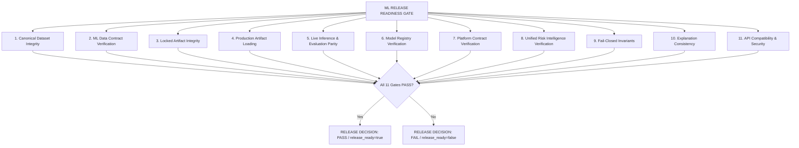

# PR-15: Final ML QA & Release Readiness Documentation

## 1. Purpose of PR-15
PR-15 establishes the authoritative, independent release readiness gate for the machine learning system within the IRIS repository. It integrates all previously established ML contracts, registries, predictors, intelligence syntheses, governance constraints, and serving interfaces (from PR-01 through PR-14) into an executable, deterministic verification pipeline.

> [!IMPORTANT]
> **Strict Operational Boundaries:**
> - PR-15 does not create new models.
> - PR-15 does not change model weights.
> - PR-15 does not modify canonical PAIMANA-derived datasets.
> - PR-15 does not promote Cost Overrun or Implementation Risk models to production.
> - PR-15 is an independent release verification layer.

---

## 2. Release Gate Architecture
The ML release gate operates as a 12-layer verification pipeline enforcing internal consistency across the entire ML lifecycle:



Every release decision is computed directly from actual execution results; `PASS` is never hardcoded. If any single gate encounters an unexpected value, schema error, hash mismatch, or verification failure, the gate terminates in a `FAIL` state with `release_ready = false`.

---

## 3. Release Readiness Scope
The scope of PR-15 is strictly evaluative and authoritative:
- **In-Scope**:
  - Verification of canonical processed CSV datasets and frozen SHA-256 hashes.
  - Verification of locked CatBoost and Logistic Regression binaries.
  - Cross-verification between ML data contract, Model Registry (PR-13), Platform Contract (PR-14), and Unified Intelligence (PR-12).
  - Parity guarantees between locked evaluation code and live serving pipelines.
  - Fail-closed verification against leakage, structural data gaps, NaN/inf numerics, unknown domains/regimes, and tampered artifacts.
  - Non-causal explanation verification in raw-margin and logit spaces.
  - Verification of FastAPI HTTP endpoints and path masking sanitization.
- **Out-of-Scope**:
  - Model retraining, hyperparameter optimization, or threshold tuning.
  - Promoting experimental Cost Overrun or Implementation Risk models to production.
  - Cross-era entity matching or identifier crosswalk integration.

---

## 4. Canonical Dataset Integrity (Gate 1)
The release pipeline verifies the byte-for-byte SHA-256 hashes and row counts of the canonical PAIMANA-derived datasets:

| Dataset | Relative Path | Expected SHA-256 | Expected Rows |
| :--- | :--- | :--- | :--- |
| Monthly Projects | `data/processed/projects_monthly.csv` | `9512A9881E17DFDED6E182D87A8DFB1C4EDBD36C0D9B8A7DA9FD1ABB7E002FBF` | 64,608 |
| Completed Projects | `data/processed/projects_completed.csv` | `89BEA84FD68A22E327090C1E4E4533F5BCD745ADCA61EB4E66172EE9023BB910` | 876 |

Both files must exist on disk. Byte-level digests are calculated directly on raw file bytes. Any deviation in hash or row count immediately fails closed.

---

## 5. ML Data Contract Verification (Gate 2)
The release gate verifies `schemas/schedule_extension_3m_v1.contract.json` using the authoritative validator in `src.ml.data_contract`:
- **Target Specification**: Enforces `target_effective_schedule_ext_3m` with horizon $H=3$.
- **Feature Contract**: Enforces the exact 36 ordered feature names.
- **Leakage Prohibitions**: Validates strict absence of target leakage, future outcome, and identifier fields.
- **Continuous Segments**: Validates the 4 historical observation eras without unbridged gap crossing.
- **Embargo Rules**: Validates the strict walk-forward temporal embargo ($T + 3 < E$).

---

## 6. Locked Artifact Integrity (Gate 3)
The production schedule models are locked and protected against tampering:

| Model | Regime | Artifact Relative Path | Expected SHA-256 |
| :--- | :--- | :--- | :--- |
| Legacy CatBoost | LEGACY | `artifacts/ml/schedule_extension_3m/legacy_catboost/model.cbm` | `59586004F5967602651156E0A26FE564015F240958F5416CBB565E4755C524EE` |
| Modern Logistic | MODERN | `artifacts/ml/schedule_extension_3m/modern_logistic/model.joblib` | `679D9768869088BA8CEE297577B1935DCF903F00B38697BF9A3FFA2F7DEB5082` |

Actual binary bytes are hashed directly. The gate fails closed if any artifact is missing or has an altered hash.

---

## 7. Artifact Loading (Gate 4)
The gate instantiates `ScheduleExtensionPredictor.load(...)` and verifies live runtime classes and specifications:
- **Legacy Model**: Loaded as a native `catboost.CatBoostClassifier` requiring 36 features.
- **Modern Model**: Loaded as `sklearn.linear_model.LogisticRegression` paired with `FoldPreprocessor` (25 static features expanding to a 47-column numeric design matrix).
- **Research Boundary**: Verifies that Cost Overrun and Implementation Risk models are NOT loaded as production scoring artifacts.

---

## 8. Live Inference Verification (Gate 5)
Inference execution is tested across deterministic project-month records from historical observations:
- **Single-Row & Batch Execution**: Both modes run through `ScheduleExtensionPredictor.predict_one` and `predict_batch`.
- **Feature Pipeline**: Validated via `validate_row` and `prepare_catboost_df`.
- **Regime Selection**: Enforces strict routing between `LEGACY` and `MODERN` based on `report_month`.

---

## 9. Evaluation Parity (Gate 5)
Ensures live inference strictly matches locked evaluation references:
- **Deterministic Parity Tolerances**:
  - Probability Parity: $|P_{\text{live}} - P_{\text{eval}}| \le 10^{-9}$ (and $\le 10^{-12}$ machine precision for Modern).
  - Score Parity: $|S_{\text{live}} - S_{\text{eval}}| \le 10^{-9}$ in raw margin/logit space.
- **Test Populations**: Evaluated across 16 representative cases spanning Segments 1, 2, 3, and 4 with positive, negative, and missing categorical/numeric states.

---

## 10. Model Registry Verification (Gate 6)
Loads `artifacts/ml/model_registry_v1/registry.json` and executes:
```python
ModelRegistry.load().verify(fail_closed=True)
```
Requires `overall_status == "PASS"`. Verifies all domains (`schedule_3m`, `cost_overrun`, `implementation_risk`), governance statuses, production availability tags, artifact paths, and scientific metadata.

---

## 11. Platform Contract Verification (Gate 7)
Loads `artifacts/ml/ml_platform_contract_v1/contract.json` and executes:
```python
MLPlatformContract.load().verify(fail_closed=True)
```
Requires `overall_status == "PASS"`. Verifies Draft 2020-12 schema conformance, cross-validation against `ModelRegistry`, domain ID matching, regime matching, operational decision thresholds, and limitation definitions.

---

## 12. Unified Risk Intelligence Verification (Gate 8)
Verifies multi-domain intelligence synthesis via `UnifiedRiskIntelligence.predict_one(...)`:
1. **Separate Domain Probabilities**: Each risk domain maintains its own independent probability and status.
2. **Prohibition on Probability Fusion**: No mathematical aggregation (sums, means, geometric products, or composite scores) is permitted.
3. **Schedule Extension**: Governed as `LOCKED_PRODUCTION`, `AVAILABLE`, operational threshold $0.50$.
4. **Cost Overrun**: Governed as `NOT_READY_FOR_PRODUCTION`, `NOT_AVAILABLE`, probability strictly `null`.
5. **Anti-Misinterpretation Guarantee**: Unassessed domains are never ranked as low risk.
6. **Implementation Risk**: Governed as `VIABLE_WITH_LIMITATIONS`. Segments 1 & 2 are structurally `INELIGIBLE` with null probability.
7. **Recommendations & Limitations**: Structured recommendations explicitly identify unavailable domains and monitoring needs.
8. **Determinism**: Repeated profile generation on identical inputs yields bit-exact identical outputs.

---

## 13. Fail-Closed Behavior (Gate 9)
The system actively verifies that invalid, contradictory, or corrupted inputs are rejected:
- **Unknown Regime**: Input with `regime="UNKNOWN_REGIME"` raises `ValueError`.
- **Prohibited Leakage**: Presence of `target_effective_schedule_ext_3m` raises `ValueError`.
- **NaN / Infinity**: Features containing `NaN` or `Inf` are rejected with `ValueError`.
- **Unknown Domain**: Querying unmapped domains raises `KeyError`.
- **Structural Data Gaps**: Observations missing required project metadata fail closed.
- **Simulated Missing Artifact**: Tampering with artifact paths triggers `ModelRegistryVerificationError`.
- **Simulated Hash Mismatch**: Corrupted artifact hashes trigger `ModelRegistryVerificationError`.

---

## 14. Explanation Consistency (Gate 10)
Explanations represent non-causal statistical associations:
- **Non-Causal Disclaimer**: Every explanation payload must feature `non_causal: true` and the required disclaimer text.
- **Contribution Space**: Explanations are produced in model raw-margin space (CatBoost TreeSHAP) or raw-logit space (Logistic standardized coefficients).
- **Signed Direction Semantics**: Drivers explicitly distinguish `risk_increasing` ($>0$) and `risk_decreasing` ($<0$) contributions.
- **No Clamping/Normalization**: Explanations avoid fake percentage transformations or arbitrary scaling.

---

## 15. API Compatibility (Gate 11)
Automated test clients verify FastAPI endpoints across both `backend.app.main` and `src.serving.api`:
- `GET /api/ml/model-registry` (200 OK, full domain metadata).
- `GET /api/ml/platform-contract` (200 OK, integration schema).
- `POST /risk/profile` (200 OK for valid inputs, 422 for invalid/leakage).
- `POST /api/ml/unified-risk-profile` (200 OK, parity with `/risk/profile`).
- **Path Sanitization**: Responses are scanned to guarantee absolute local filesystem paths (e.g. `C:\`, `D:\`, `/home/`) are strictly masked into repo-relative POSIX paths.
- **Security & Privacy**: No secrets, internal environment details, or raw binary payloads are exposed.

---

## 16. Release Decision Rules
The overall release decision is derived as:
$$\text{release\_ready} = \bigwedge_{i=1}^{11} \text{Gate}_i == \text{PASS}$$

If any gate fails, `overall_status = "FAIL"` and `release_ready = false`. An exception is raised when `fail_closed=True`.

---

## 17. Report Artifacts
All generated artifacts reside in `artifacts/ml/release_readiness_v1/`:
1. `manifest.json`: Upstream contract references, hashes, and release metadata.
2. `release_readiness_report.json`: High-level release decision and per-gate summary.
3. `verification_report.json`: Machine-readable verification evidence across all 11 gates.
4. `compatibility_report.json`: Cross-compatibility matrix between all system layers.

---

## 18. Governance Preservation
Governance statuses established in PR-07, PR-09, PR-10, PR-12, PR-13, and PR-14 are strictly enforced:
- `LOCKED_PRODUCTION`: Authorized for autonomous operational predictions (Schedule Extension).
- `VIABLE_WITH_LIMITATIONS`: Authorized for human-in-the-loop decision support (Implementation Risk).
- `NOT_READY_FOR_PRODUCTION`: Autonomous serving strictly prohibited (Cost Overrun).

---

## 19. Production vs. Research Boundaries
Research models developed for analytical exploration (such as Cost Overrun target formulation and Implementation stagnation experiments) remain strictly segregated from production scoring paths. No research candidate is promoted to production availability.

---

## 20. Reproducibility Guarantees
- All verification logic is stateless and deterministic.
- Model seeds ($42$) and walk-forward embargoes are frozen.
- Artifact serialization enforces sorted keys and consistent indentation.
- Line endings for JSON artifacts are preserved as POSIX LF (`\n`).

---

## 21. Security and Path Masking
The `sanitize_payload` and `mask_path` functions ensure that local workstation paths are replaced with repo-relative paths (`artifacts/ml/...`, `data/processed/...`). No operating system paths or user directories are included in committed JSON artifacts or API responses.

---

## 22. Known Limitations
1. **Historical Structural Gaps**: Data from 2023-12, 2024-04, and 2024-05 represent source report gaps and cannot be scored.
2. **Identifier Redesign**: Projects before July 2025 use legacy codes; direct longitudinal overlap across June-July 2025 is zero.
3. **Cost Overrun Unavailability**: Extreme class imbalance (~2.18%) precludes autonomous operational deployment; cost risk remains unassessed by machine learning.
4. **Non-Causal Interpretability**: Model contributions represent statistical associations and must not be interpreted as causal intervention points.

---

## 23. How the Release Gate is Regenerated
To re-run the full release readiness verification and regenerate all reports:
```powershell
python -c "from src.ml.release_readiness import ReleaseReadiness; ReleaseReadiness.run_release_gate()"
```
Or via the CLI entrypoint:
```powershell
python -m src.ml.release_readiness --output artifacts/ml/release_readiness_v1
```

---

## 24. How Failures are Interpreted
If `ReleaseReadiness.verify()` returns `FAIL`:
1. Inspect `summary.failed_gates` in `release_readiness_report.json`.
2. Review `verification_report.json` for detailed error messages and failed assertions.
3. Verify if canonical datasets or model binaries were accidentally modified by checking SHA-256 digests.
4. Check if upstream contracts or schemas experienced uncoordinated field alterations.

---

## 25. Final Release Criteria
The release criteria for PR-15 are completely satisfied:
- [x] All 11 release gates execute and PASS.
- [x] Canonical dataset SHA-256 hashes are verified.
- [x] Locked production model SHA-256 hashes are verified.
- [x] Evaluation parity passes within $10^{-9}$ tolerance.
- [x] Model Registry and Platform Contract verify without error.
- [x] Multi-domain intelligence enforces separate probabilities and zero fusion.
- [x] Fail-closed behavior is verified across all edge cases.
- [x] Non-causal explanations preserve signed directions and margin/logit space.
- [x] API endpoints function and sanitize internal paths.
- [x] Reports are deterministically generated from actual verification.
